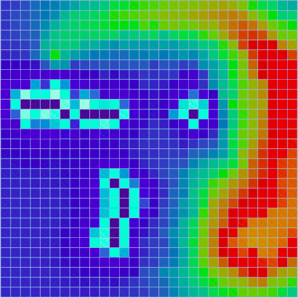
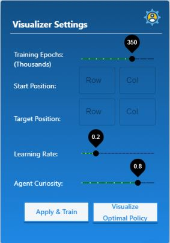

<h1 align="center">3D Machine Learning & Pathfinding Algorithm Visualizer </h1>


  
  
  
  
  




*A Visualizer for some common pathfinding and machine learning algorithms in 3D.*
## Live Demo
A live interactive demo can be found [here](https://zmaqutu.github.io/3D-Pathfinding-Visualizer/).
<div align="center" >
   
</div>

## Features
### Machine Learning algorithms
* **Q-Learning** <br>
This is classical reinforcement learning algorithm. We initialize an agent to a random location on the map and have it learn about its environment through a series of explorative(random) and exploitative(most rewarding) actions. In this algorithm the aim is to train an agent (in this case a robot delivering packages) to find an optimal path from start to finish, while avoiding "walls" or "ditches" at all costs. An example of a trained agent (with a curiosity of 0.3) is shown below. 


Notice how the agent has learned to completely avoid the area south of its starting position because of a cluster of walls. You can change the agent's behaviour for both training and optimal policy visualization by changing the setting in the panel shown below.



### Weighted and unweighted algorithms
* **Dijkstra’s algorithm** (weighted) <br>
The father of pathfinding algorithms, it creates a tree of shortest paths from the starting vertex, the source, to all other points in the graph. As shown in the image below this algorithm does not care to avoid the area around the walls. <b>Guarantees</b> the shortest path!


* **A\* Search algorithm** (weighted) <br>
One of the best and a popular technique used in path-finding and graph traversals with heuristic. <b>Guarantees</b> the shortest path!

* **Breadth-First Search** (unwighted) <br>
The algorithm starts at the tree root, and explores all of the neighbor nodes at the present depth prior to moving on to the nodes at the next depth level. <b>Guarantees</b> the shortest path!

* **Depth-First Search** (unwighted) <br>
The algorithm starts at the root node and explores as far as possible along each branch before backtracking. <b>Does not guarantee</b> the shortest path!

### Maze generation
Two methods to generate a maze:
* Recursive Division 
* Random Maze

### Libraries used
* Three.js
* react-three-fiber
* Tween.js
* Tensorflow JS

## Contributing
Contributions are welcome. Please feel free to make a PR.

## Project setup
This project was bootstrapped with [Create React App](https://github.com/facebook/create-react-app).
```
npm install
npm start
```
Runs the app in the development mode.\
Open [http://localhost:3000](http://localhost:3000) to view it in the browser.

## Future Scope
* Add model of the martian surface and a package delivery robot for visualization
* Add button to toggle node information as text on each node in shortest path
* Add more algorithms to visualize

<p align="center">Made with ❤️ in React JS</p>